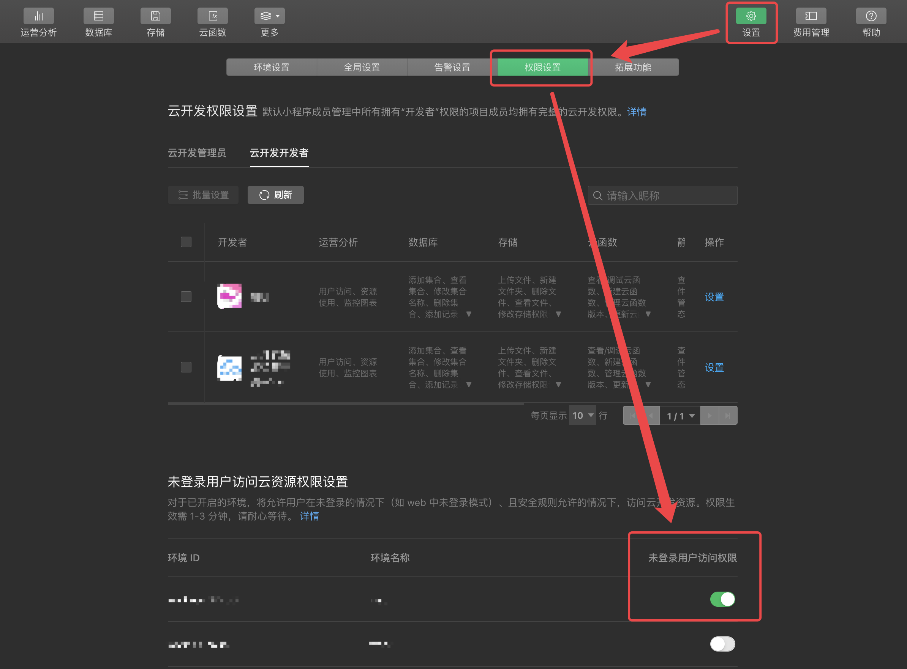
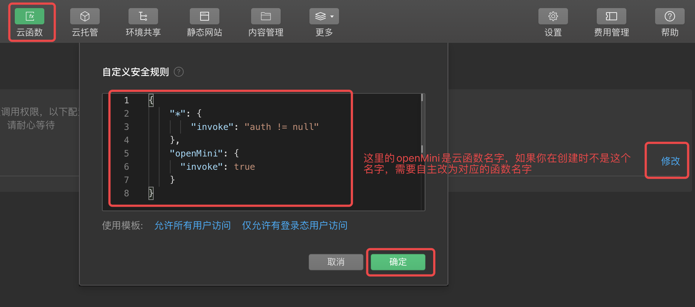
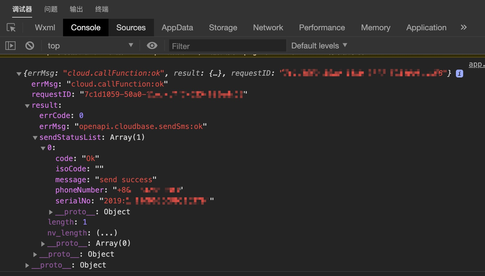

# 短信跳转小程序教程

### 一、能力介绍

境内非个人主体的认证的小程序，开通静态网站并后，可以免鉴权下发支持跳转到相应小程序的短信。短信中会包含支持在微信内或微信外打开的静态网站链接，用户打开页面后可一键跳转至你的小程序。

这个链接的网页在外部浏览器是通过 URL Scheme 的方式来拉起微信打开主体小程序的。

总之，短信跳转能力的实现分为两个步骤，「配置拉起网页」和「发送短信」。本教程将介绍如何执行操作完成短信跳转小程序的能力。

### 二、网页创建

首先我们需要构建一个基础的网页应用，在任何代码编辑器创建一个 html 文件，在教程这里命名为 index.html 

在这个 html 文件中输入如下代码，并根据注释提示更换自己的信息：
``` js
<script src="https://acc.cloudbase.vip/res/web2weapp.js" charset="utf-8"></script>
<script>
  window.onload = function(){
    window.web2weapp.init({
      appId: 'wx999999', //替换为自己小程序的AppID
      gh_ID: 'gh_999999',//替换为自己小程序的原始ID
      env_ID: 'tcb-env',//替换小程序底下云开发环境ID
      function: {
        name:'openMini',//提供UrlScheme服务的云函数名称
        data:{} //向这个云函数中传入的自定义参数
      },
      path: 'pages/index/index.html' //打开小程序时的路径
    })
  }
</script>
```

以上引入的 [web2weapp.js](https://acc.cloudbase.vip/res/web2weapp.js) 文件是教程封装的有关拉起微信小程序的极简应用，我们直接引用即可轻松使用。

**如果你想进一步学习和修改其中的一些WEB展示信息，可以前往 [github](https://github.com/TCloudBase/WXSEVER-SMS) 获取源码并做修改。**

**有关于网页拉起小程序的更多信息可以访问[官方文档](https://developers.weixin.qq.com/miniprogram/dev/wxcloud/guide/staticstorage/jump-miniprogram.html)**

如果你只想体验短信跳转功能，在执行完上述文件创建操作后，继续以下步骤。

### 三、创建服务云函数

在上面创建网页的过程中，需要填写一个UrlScheme服务云函数。这个云函数主要用来调用微信服务端能力，获取对应的Scheme信息返回给调用前端。

我们在示例中填写的是 openMini 这个命名的云函数。

我们前往微信开发者工具，定位对应的云开发环境，创建一个云函数，名称叫做 openMini 。

在云函数目录中 index.js 文件替换输入以下代码：
``` js
const cloud = require('wx-server-sdk')
cloud.init()

exports.main = async (event, context) => {
  return cloud.openapi.urlscheme.generate({
    jumpWxa: {
      path: '', // 打开小程序时访问路径，为空则会进入主页
      query: '',// 可以使用 event 传入的数据制作特定参数，无需求则为空
    },
    isExpire: true, //是否到期失效，如果为true需要填写到期时间，默认false
    expire_time: Math.round(new Date().getTime()/1000) + 3600
    //我们设置为当前时间3600秒后，也就是1小时后失效
    //无需求可以去掉这两个参数（isExpire，expire_time）
  })
}
```

保存代码后，在 index.js 右键，选择增量更新文件即可更新成功。

接下来，我们需要开启云函数的未登录访问权限。进入小程序云开发控制台，转到设置-权限设置，找到下方未登录，选择上几步我们统一操作的那个云开发环境（注意：第一步配置的云开发环境和云函数所在的环境，还有此步操作的环境要一致），勾选打开未登录


接下来，前往云函数控制台，点击云函数权限，安全规则最后的修改，在弹出框中按如下配置：


### 四、本地测试

我们在本地浏览器打开第一步创建的 index.html ；唤出控制台，如果效果如下图则证明成功：


### 五、上传至静态网站托管

将本地创建好的 index.html 上传至静态网站托管，在这里静态托管需要是**小程序本身的云开发环境里的**静态托管。

如果你上传至其他静态托管或者是服务器，你仍然可以使用外部浏览器拉起小程序的能力，但会丧失在微信浏览器用开放标签拉起小程序的功能，也不会享受到云开发短信发送跳转链接的能力。

如果你的目标小程序底下有多个云开发环境，则不需要保证云函数和静态托管在一个环境中，无所谓。

比如你有A、B两个环境，A部署了上述的云函数，但是把 index.html 部署到B的环境静态托管中了，这个是没问题的，符合各项能力要求。只需要保证第一步 index.html 网页中的云开发环境配置是云函数所在环境即可。

部署成功后，你便可以访问静态托管的所在地址了，可以通过手机外部浏览器以及微信内部浏览器测试打开小程序的能力了。

### 六、短信发送云函数的配置

在上面创建 openMini 云函数的环境中再来一个云函数，名字叫 sendsms 。

在此云函数 index.js 中配置如下代码：
``` js
const cloud = require('wx-server-sdk')
cloud.init({
	env: cloud.DYNAMIC_CURRENT_ENV,
})
exports.main = async (event, context) => {
	try {
		const config = {
			env: event.env,
			content: event.content ? event.content : '发布了短信跳转小程序的新能力',
			path: event.path,
			phoneNumberList: event.number
		}
		const result = await cloud.openapi.cloudbase.sendSms(config)
		return result
	} catch (err) {
		return err
	}
}
```
保存代码后，在 index.js 右键，选择增量更新文件即可更新成功。

### 七、测试短信发送能力

在小程序代码中，在 app.js 初始化云开发后，调用云函数，示例代码如下：
``` js
App({
  onLaunch: function () {
    wx.cloud.init({
      env:"tcb-env", //短信云函数所在环境ID
      traceUser: true
    })
    wx.cloud.callFunction({
      name:'sendsms',
      data:{
        "env": "tcb-env",//网页上传的静态托管的环境ID
        "path":"/index.html",//上传的网页相对根目录的地址，如果是根目录则为/index.html
        "number":[
          "+8616599997777" //你要发送短信的目标手机，前面需要添加「+86」
        ]
      },success(res){
        console.log(res)
      }
    })
  }
})
```

重新编译运行后，在控制台中看到如下输出，即为测试成功：



你会在发送的目标手机中收到短信，因为短信中包含「退订回复T」字段，可能会触发手机的自动拦截机制，需要手动在拦截短信中查看。

**需要注意：你可以把短信云函数和URLScheme云函数分别放置在不同云开发环境中，但必须保证所放置的云开发环境属于你操作的小程序**

**另外，出于防止滥用考虑，短信发送的云调用能力需要真实小程序用户访问才可以生效，你不能使用云端测试、云开发JS-SDK以及其他非wx.cloud调用方式（微信侧WEB-SDK除外），会提示如下错误：**


如果你想在其他处使用此能力，可以使用服务端API来做正常HTTP调用，具体访问[官方文档](https://developers.weixin.qq.com/miniprogram/dev/api-backend/open-api/cloudbase/cloudbase.sendSms.html)

### 总结

1. 短信跳转小程序核心是静态网站中配置的可跳转网页，外部浏览器通过URL Scheme 来实现的，这个方式不适用于微信浏览器，需要使用开放标签才可以。
2. URL Scheme的生成是云调用能力，需要是目标小程序的云开发环境的云函数中使用才可以。并且生成的URL Scheme只能是自己小程序的打开链接，不能是任意小程序（和开放标签的任意不一致）
3. 短信发送能力的体验是1000条，如果有大规模使用的需要，可以联系官方增加。
4. 短信发送也是云调用能力，需要真实小程序用户调用才可以正常触发，其他方式均报错返回参数错误，出于防止滥用考虑。
5. 云函数和网页的放置可以不在同一个环境中，只需要保证所属小程序一致即可。（需要保证对应环境ID都能接通）
6. 如果你不需要短信能力，可以忽略最后两个步骤。

